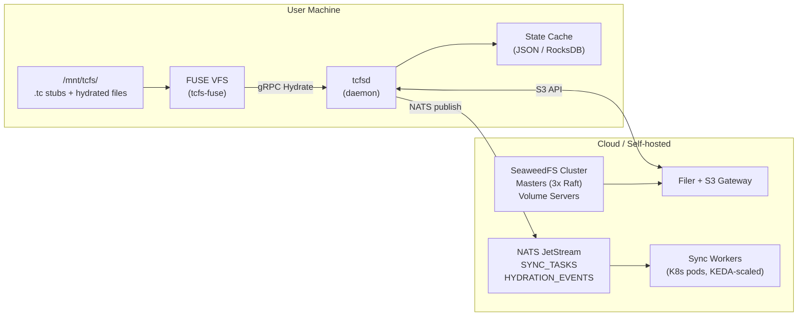
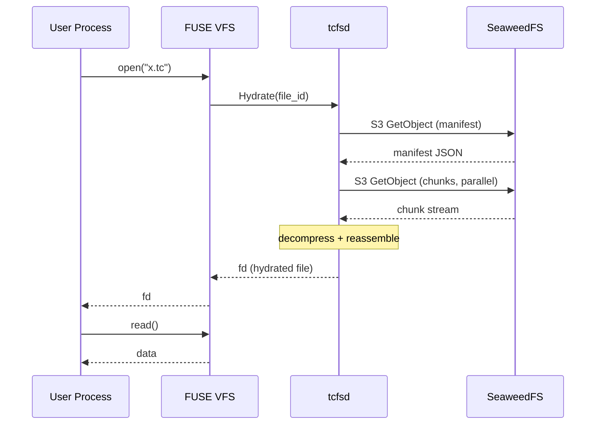
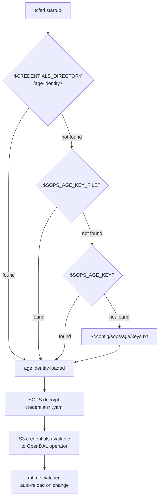

# tcfs Architecture

**tcfs** (TummyCrypt FileSystem) is a FOSS, self-hosted, S3-first synchronization system that
replaces proprietary cloud storage clients (odrive, Dropbox, etc.) with a FUSE-based mount
that transparently hydrates files on demand.

## System Overview



## Components

### Client-side

| Component | Binary | Purpose |
|-----------|--------|---------|
| `tcfs-core` | (library) | Shared types, config schema, proto defs |
| `tcfs-crypto` | (library) | XChaCha20-Poly1305 encryption, key derivation |
| `tcfs-secrets` | (library) | SOPS/age/KDBX credential chain |
| `tcfs-storage` | (library) | OpenDAL abstraction, SeaweedFS native API |
| `tcfs-chunks` | (library) | FastCDC chunking, BLAKE3 hashing, zstd |
| `tcfs-sync` | (library) | Sync engine: state cache, NATS workers |
| `tcfs-fuse` | (library) | Linux FUSE driver (fuse3 crate) |
| `tcfs-cloudfilter` | (library) | Windows Cloud Files API (skeleton) |
| `tcfs-sops` | (library) | SOPS+age fleet secret propagation |
| `tcfsd` | `tcfsd` | Daemon: gRPC server, FUSE mount mgr, cred loader |
| `tcfs-cli` | `tcfs` | CLI: mount, push, pull, sync, status, unsync |
| `tcfs-tui` | `tcfs-tui` | TUI: dashboard, config viewer, mounts, secrets |
| `tcfs-mcp` | `tcfs-mcp` | MCP server: 6 tools for AI agent integration |

### Server-side (K8s)

| Component | Purpose |
|-----------|---------|
| SeaweedFS cluster | Distributed blob storage |
| NATS JetStream | Reliable task queue (SYNC_TASKS, HYDRATION_EVENTS) |
| Sync workers | Stateless NATS consumers, HPA-scaled via KEDA |
| Metadata service | Leader-elected coordinator (Kubernetes Lease API) |
| Prometheus + Grafana | Observability: throughput, queue depth, FUSE latency |

## Stub File Format

Files not yet downloaded appear as `.tc` stubs. The stub is a JSON file containing
metadata needed to reconstruct the original file:

```json
{
  "version": 1,
  "file_id": "<BLAKE3 hash of original file, hex>",
  "original_name": "photo.jpg",
  "original_size": 4194304,
  "mime_type": "image/jpeg",
  "modified_at": "2026-02-20T12:00:00Z",
  "chunk_count": 3,
  "manifest_key": "chunks/manifests/<file_id>",
  "remote_prefix": "tcfs/default"
}
```

Directory stubs use the `.tcf` extension and list child entries.

See `docs/PROTOCOL.md` for the full specification.

## Hydration Sequence



After hydration, `x.tc` is atomically replaced with `x` (the real file).
`tcfs unsync x` converts it back to a stub.

## Credential Chain



## Phase Roadmap

| Phase | Scope | Status |
|-------|-------|--------|
| 0 | Repo foundation, SOPS migration, Rust workspace stubs | Complete |
| 1 | Core daemon + secrets + gRPC | Complete |
| 2 | Sync engine + chunking + NATS | Complete |
| 3 | FUSE driver + .tc stubs + hydration | Complete |
| 4 | K8s backend + HPA + full Tofu deploy | Complete |
| 5 | Release pipeline + packaging + docs site | Complete |
| 6 | macOS FUSE-T + Windows CFAPI skeleton + GitLab mirror | Complete |
| 7 | Production hardening + chaos tests | Pending |

## Real Infrastructure

### Local Network (bare-metal)

| Role | Address |
|------|---------|
| SeaweedFS master-1 | 192.168.101.249:9333 |
| SeaweedFS master-2 | 192.168.101.184:9333 |
| SeaweedFS master-3 | 192.168.101.248:9333 |
| Volume server (Drobo 5C) | 192.168.101.171:8080 |
| Filer / S3 gateway | 192.168.101.146:8333 |

### Civo Kubernetes

| Property | Value |
|----------|-------|
| Cluster | bitter-darkness-16657317 |
| Namespace | tcfs |
| In-cluster SeaweedFS | seaweedfs.tcfs.svc.cluster.local:8333 |
| In-cluster NATS | nats.tcfs.svc.cluster.local:4222 |
| Container image | ghcr.io/tinyland-inc/tcfsd |
