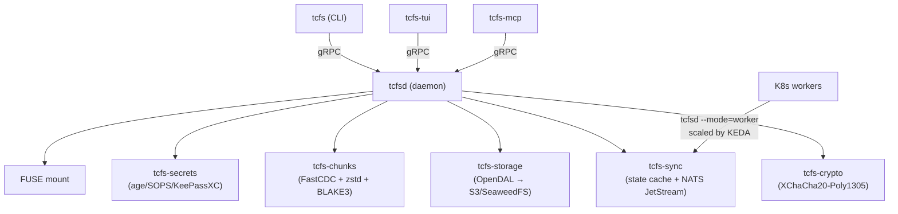

# tcfs — TummyCrypt Filesystem

**FOSS self-hosted odrive replacement**

tcfs is a FUSE-based file sync daemon backed by [SeaweedFS](https://github.com/seaweedfs/seaweedfs) with end-to-end [age](https://age-encryption.org) encryption, content-defined chunking, and on-demand hydration via `.tc` stub files.

## Installation

### Binary Releases

Download the latest release from [GitHub Releases](https://github.com/tinyland-inc/tummycrypt/releases):

```bash
# Linux (x86_64)
curl -fsSL https://github.com/tinyland-inc/tummycrypt/releases/latest/download/install.sh | sh

# macOS (Homebrew)
brew install tinyland-inc/tap/tcfs

# Debian/Ubuntu
sudo dpkg -i tcfs-*.deb

# RPM (Fedora/RHEL/Rocky)
sudo rpm -i tcfsd-*.rpm
```

### From Source

```bash
# Requires Rust 1.93+, protoc, libfuse3-dev
git clone https://github.com/tinyland-inc/tummycrypt.git
cd tummycrypt
cargo build --release
# Binaries: target/release/tcfs, target/release/tcfsd, target/release/tcfs-tui, target/release/tcfs-mcp
```

### Nix

```bash
nix build github:tinyland-inc/tummycrypt
# Or enter a devShell:
nix develop github:tinyland-inc/tummycrypt
```

### Container (K8s worker mode)

```bash
podman pull ghcr.io/tinyland-inc/tcfsd:latest
```

## How It Works

1. **Push**: Files are split into content-defined chunks (FastCDC), compressed (zstd), encrypted (age), and uploaded to SeaweedFS via S3.
2. **Pull**: Manifests describe the chunk layout. Chunks are fetched, verified (BLAKE3), decrypted, decompressed, and reassembled.
3. **Mount**: FUSE driver presents remote files as local. Files appear as `.tc` stubs until opened — then they're hydrated on demand.
4. **Unsync**: Convert hydrated files back to stubs, reclaiming disk space while keeping the remote copy.

## Architecture



## Binaries

| Binary | Purpose |
|--------|---------|
| `tcfs` | CLI: push, pull, sync-status, mount, unmount, unsync |
| `tcfsd` | Daemon: gRPC socket, FUSE mounts, Prometheus metrics, systemd notify |
| `tcfs-tui` | Terminal UI for interactive file management |
| `tcfs-mcp` | MCP server: AI agent integration (6 tools, stdio transport) |

## Documentation

- [Architecture](ARCHITECTURE.md) — detailed system design
- [Protocol](PROTOCOL.md) — wire format, chunk layout, manifest schema
- [Security](SECURITY.md) — threat model, encryption details
- [Contributing](CONTRIBUTING.md) — development setup, PR workflow
- [Benchmarks](BENCHMARKS.md) — performance characteristics

## Platform Support

| Platform | Status | Notes |
|----------|--------|-------|
| Linux x86_64 | Full | FUSE mount, CLI, daemon, TUI, MCP |
| Linux aarch64 | Full | FUSE mount, CLI, daemon, TUI, MCP |
| macOS (Apple Silicon) | CLI + FUSE-T | FUSE via macFUSE/FUSE-T, platform-conditional unmount |
| macOS (Intel) | CLI + FUSE-T | FUSE via macFUSE/FUSE-T, platform-conditional unmount |
| Windows x86_64 | CLI + CFAPI skeleton | Cloud Files API for native Explorer integration |
| NixOS | Full | Flake + NixOS module + Home Manager module |

## License

Dual-licensed under MIT and Apache 2.0.
