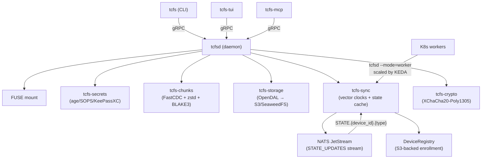

# tcfs — TummyCrypt Filesystem

**FOSS self-hosted odrive replacement**

tcfs is a FUSE-based file sync daemon backed by [SeaweedFS](https://github.com/seaweedfs/seaweedfs) with end-to-end [age](https://age-encryption.org) encryption, content-defined chunking, on-demand hydration via `.tc` stub files, and multi-machine fleet sync with vector clocks.

## Installation

### Binary Releases

Download the latest release from [GitHub Releases](https://github.com/tinyland-inc/tummycrypt/releases):

```bash
# Linux (x86_64)
curl -fsSL https://github.com/tinyland-inc/tummycrypt/releases/latest/download/install.sh | sh

# macOS (Homebrew)
brew install tinyland-inc/tap/tcfs

# Debian/Ubuntu
sudo dpkg -i tcfs-*.deb

# RPM (Fedora/RHEL/Rocky)
sudo rpm -i tcfsd-*.rpm
```

### Container (K8s worker mode)

```bash
podman pull ghcr.io/tinyland-inc/tcfsd:latest
```

### From Source

```bash
# Requires Rust 1.93+, protoc, libfuse3-dev
git clone https://github.com/tinyland-inc/tummycrypt.git
cd tummycrypt
cargo build --release
# Binaries: target/release/tcfs, target/release/tcfsd, target/release/tcfs-tui, target/release/tcfs-mcp
```

### Nix

```bash
nix build github:tinyland-inc/tummycrypt
# Or enter a devShell:
nix develop github:tinyland-inc/tummycrypt
```

## How It Works

1. **Push**: Files are split into content-defined chunks (FastCDC), compressed (zstd), encrypted (age), and uploaded to SeaweedFS via S3. Vector clock is ticked and SyncManifest v2 (JSON) is written.
2. **Pull**: Manifests describe the chunk layout. Chunks are fetched, verified (BLAKE3), decrypted, decompressed, and reassembled. Vector clock is merged with remote.
3. **Mount**: FUSE driver presents remote files as local. Files appear as `.tc` stubs until opened — then they're hydrated on demand.
4. **Unsync**: Convert hydrated files back to stubs, reclaiming disk space while keeping the remote copy.
5. **Fleet Sync**: NATS JetStream distributes `StateEvent` messages across devices. Vector clocks detect conflicts; pluggable resolvers handle them (auto, interactive, or defer).

## Architecture



## Binaries

| Binary | Purpose |
|--------|---------|
| `tcfs` | CLI: push, pull, sync-status, mount, unmount, unsync, device management |
| `tcfsd` | Daemon: 11 gRPC RPCs, FUSE mounts, NATS state sync, Prometheus metrics, systemd notify |
| `tcfs-tui` | Terminal UI: 5-tab dashboard (Dashboard, Config, Mounts, Secrets, Conflicts) |
| `tcfs-mcp` | MCP server: 8 tools for AI agent integration (stdio transport) |

## CLI Commands

| Command | Description |
|---------|-------------|
| `tcfs status` | Show daemon status, device identity, NATS connection |
| `tcfs config show` | Display active configuration |
| `tcfs push <path>` | Upload files with chunking, encryption, vector clock tick |
| `tcfs pull <remote> <local>` | Download files with conflict detection |
| `tcfs sync-status <path>` | Check sync state of a file |
| `tcfs mount <source> <target>` | FUSE mount with on-demand hydration |
| `tcfs unmount <path>` | Unmount FUSE directory |
| `tcfs unsync <path>` | Convert hydrated file back to `.tc` stub |
| `tcfs device enroll` | Generate keypair and register in S3 |
| `tcfs device list` | Show all enrolled devices |
| `tcfs device revoke <name>` | Mark a device as revoked |
| `tcfs device status` | Show this device's identity |

## Documentation

### Design Documents (LaTeX → PDF)

Technical design docs are maintained as LaTeX source and built to PDF by CI:

- [Architecture](ARCHITECTURE.md) ([source](tex/architecture.tex)) — system design, crate map, hydration sequence
- [Protocol](PROTOCOL.md) ([source](tex/protocol.tex)) — wire format, chunk layout, manifest schema, gRPC RPCs
- [Security](SECURITY.md) ([source](tex/security.tex)) — threat model, encryption architecture

Build locally: `task docs:pdf` (outputs to `dist/docs/`)

### Guides (Markdown)

- [Contributing](CONTRIBUTING.md) — development setup, PR workflow
- [Benchmarks](BENCHMARKS.md) — performance characteristics
- [Changelog](../CHANGELOG.md) — release history

### RFCs

- [RFC 0001: Fleet Sync Integration](rfc/0001-fleet-sync-integration.md) — multi-machine sync design and rollout plan
- [RFC 0002: Darwin File Integration](rfc/0002-darwin-file-integration.md) — FileProvider as primary macOS/iOS path
- [RFC 0003: iOS File Provider](rfc/0003-ios-file-provider.md) — UniFFI bridge and .appex architecture

## Platform Support

| Platform | Status | Notes |
|----------|--------|-------|
| Linux x86_64 | Full | FUSE mount, CLI, daemon, TUI, MCP |
| Linux aarch64 | Full | FUSE mount, CLI, daemon, TUI, MCP |
| macOS (Apple Silicon) | CLI + FUSE-T | Daemon over Unix socket; FileProvider extension in progress (RFC 0002) |
| macOS (Intel) | CLI + FUSE-T | Daemon over Unix socket; FileProvider extension in progress (RFC 0002) |
| Windows x86_64 | CLI only | Cloud Files API skeleton; no FUSE or daemon |
| NixOS | Full | Flake + NixOS module + Home Manager module |

## License

Dual-licensed under MIT and Apache 2.0.
